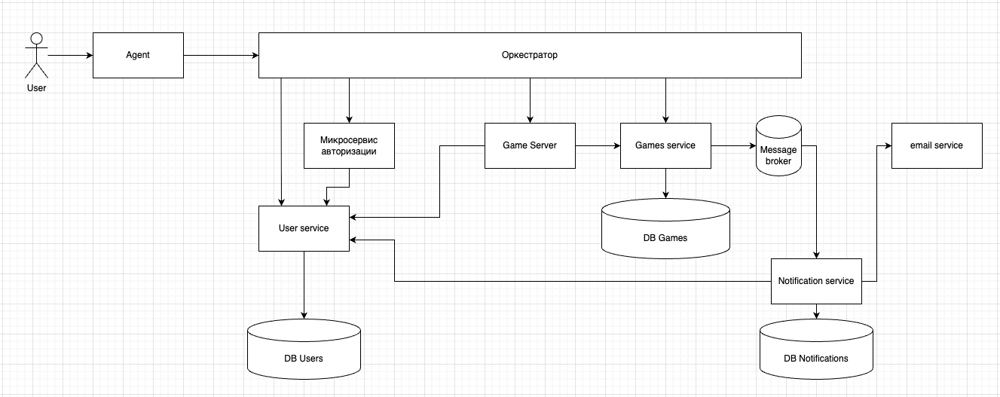

| Узел                    | Пояснение                                                                                                                                                                                   | 
|-------------------------|---------------------------------------------------------------------------------------------------------------------------------------------------------------------------------------------|
| Agent                   | приложение-агент, через которое пользователь взаимодействует с игрой                                                                                                                        |
| Оркестратор             | Gateway, который принимает запросы от Agent и направляет в нужный сервис                                                                                                                    |
| Game server             | Главный сервер, на котором происходит вычисление игр                                                                                                                                        |
| Микросервис авторизации | Сервис, отвечающий за выдачу и проверку jwt                                                                                                                                                 |
| User service            | Сервис взаимодействия с DB Users. Регистрирует новыйх пользователей, проверяет креды существующих.  Возвращает список пользователей при поиске и обновляет количество рейтинговых очков |
| Games service           | Сервис взаимодейтсвия с DB Games.                                                                                                                                                           |
| Notification service    | Сервис взаимодейтсвия с DB Notifications. Регистрирует новые уведомления и инициирует их отправку в нужное время                                                                            |
| email service           | Сторонний сервис. Принимает от Notification service команды на отправку уведомлений                                                                                                         |
| DB Users                | Хранит информацию о пользователях. Их логин, пароль, контактная информация (email), рейтинговые очки                                                                                        |
| DB Games                | Хранит информацию о турнирах. Название, дату проведения, список участинков, список заявителей,  рейтинговые очки и результаты (для прошедших), статус (ожидается, проводится, прошел)   |
| DB Notifications        | Хранит список уведомлений. Время для отправки, само уведомление, получателя                                                                                                                 |

## Endpoints
### Game server

- POST /games/start - начало турнира. Получает от Оркестратора

### Микросервис авторизации

- POST /users/login - авторизация, выдача jwt. Получает от Оркестратора

### User service

- POST /users/signup - регистрация (запись нового пользователя в DB). Получает от Оркестратора
- POST /users/authorize - проверка правильности кредов при авторизации. Получает от Микросервиса авторизации
- GET /users/find - получить список users по критериям (поиск игроков для приглашения на турнир при его создании). Получает от Оркестратора
- PUT /users/points/add - добавить рейтинговые очки существующему пользователю. Получает от Game Server
- GET /users/email - получить email пользователя для отправки уведомления. Получает от Notification service

### Games service

- POST /games/create - создать турнир. Вместе с этим отправляется message с уведомлением в Message broker. Получает от Оркестратора
- POST /games/start - поменять статус турнира в DB на активный. Получает от Game server
- POST /games/end - поменять статус турнира в DB на завершившийся и записать рейтинговые очки турнира. Получает от Game server
- GET /games/find/future - получить список будущих игр по критериям. Получает от Оркестратора
- GET /games/find/current - получить список текущих игр по критериям. Получает от Оркестратора
- GET /games/find/results - получить список прошедших игр с результатами. Получает от Оркестратора
- POST /games/request - подать заявку на участие в турнире (добавить user, как заявителя для турнира в DB). Вместе с этим отправляются message с уведомлением в Message broker. Получает от Оркестратора
- PUT /games/request/result - поменять статус заявителя в турнире (в DB). Вместе с этим отправляется message с уведомлением в Message broker. Получает от Оркестратора

### Notification service
Получает сообщения от Message Broker. Которые базово являются командами на создании в DB записи с уведомлением. Тут разделил разные виды уведомлений для наглядности

- create_request_notification - уведомление о запросе участвовать в турнире. Получает от Games service
- create_request_result_notification - уведомление о решении по запросу участвовать в турнире. Получает от Games service
- create_invite_notification - уведомление о приглашении на турнир. Получает от Games service
- create_remind_notification - уведомление о скором начале турнира. Получает от Games service
- create_game_end_notification - уведомление об окончании турнира. Получает от Games service

Сервис получает сообщение, создает запись в базе и имеет в себе scheduler, который каждые n времени читает записи с базы, которые удовлетворяют требованию: время отправки подошло.   
Для подходящие под отправку уведомлений из User service берется адрес и уведомление перенаправляется в email service для отправки.

## Узкие места и потенциальные проблемы масштабирования
| Сервис                  | Проблема                                                                                                                                                                   | Решение                                                                                                                                                                                  |
|-------------------------|----------------------------------------------------------------------------------------------------------------------------------------------------------------------------|------------------------------------------------------------------------------------------------------------------------------------------------------------------------------------------|
| Микросервис авторизации | Каждая команда от Agent должна проверяться в Микросервисе авторизации на валидность jwt. Это создает лишнюю нагрузку, когда команд будет много, например, во время турнира | Если jwt был проверен успешно, то для базовых команд (например, управления кораблем в игре) не проводить проверку этого jwt какое-то время (закешировать положительный ответ от сервиса) |
| Email service           | Сторонний сервис отправки уведомлений через email может не работать по независящим от нас причинам                                                                         | Создание альтернативного способа отправки уведомлений (и сервиса для этого, соответственно)                                                                                              |
| Game server             | Если общение Agent с Game server осущесвляется через HTTP оркестратор, то это влечет за собой задержки во время игры                                                       | Следует установить соездинение Agent и Game Server через web socket                                                                                                                      |
| Game server             | Если user-ов становится слишком много и один Game Server не успевает обрабаывать слишком много одноврмененных турниров, это может привести к задержкам                     | Можно создать большее количество Game Server-ов по той же схеме. Необходимо, чтобы Оркестратор отправлял команды игров турнира на нужный Game Server для корректной работы               |

## Компоненты, к которым чаще всего будут меняться требования
| Компонент   | Изменение                                                                                            | Решение                                                                                                                  |
|-------------|------------------------------------------------------------------------------------------------------|--------------------------------------------------------------------------------------------------------------------------|
| Game server | Новые правила игры, новые способности у пользователей, а значит новые команды от Agent в Game server | Game Server работает как event loop с обработкой команд. Поэтому добавление нового типа команды должно удовлетворять OCP |
| User server | Новые параметры у игрока, например необходимость сохранять бонусные способности игрока               | Использование композиции для дополнения функционала игрока должно удовлетворять OCP                                      |
